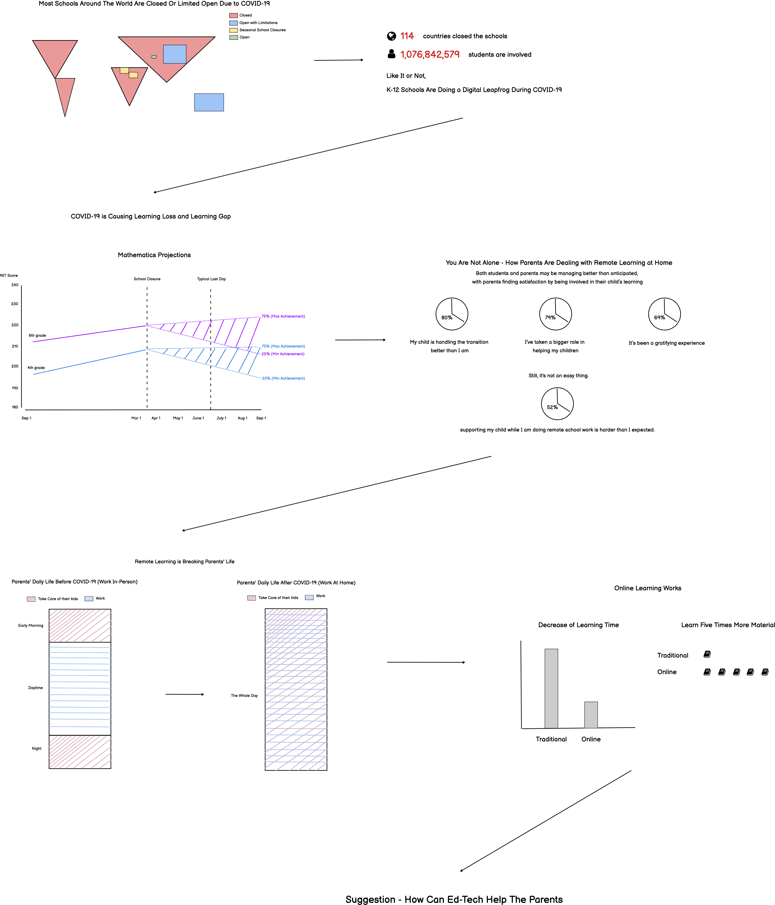

# Final Project - The pandemic could result in learning loss, but parents' involvement in the remote learning may help their kids.
## Table of Contents
  * [Project Outline](project-outline.md)
  * [Data Sources](data-sources.md)
  * Wireframes (You are here)
  * [Testing and Iteration](/testing-and-iteration.md)
  * [Method to Present](/method-to-present.md)
  * [Final Deliverable](/final-deliverable.md)

This is the wireframe to show the rough story.

